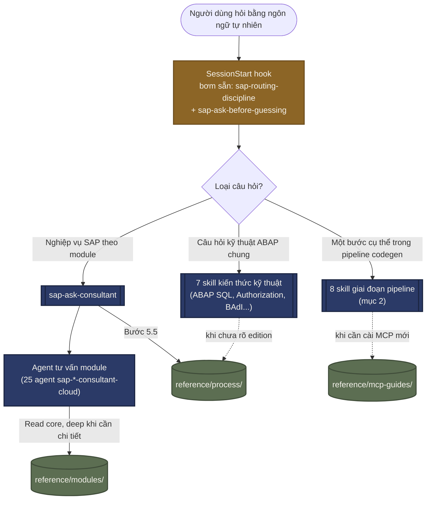
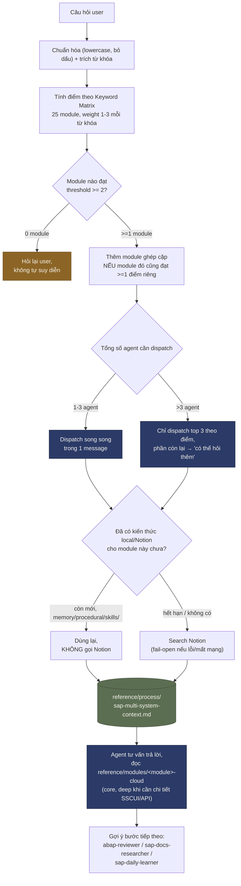
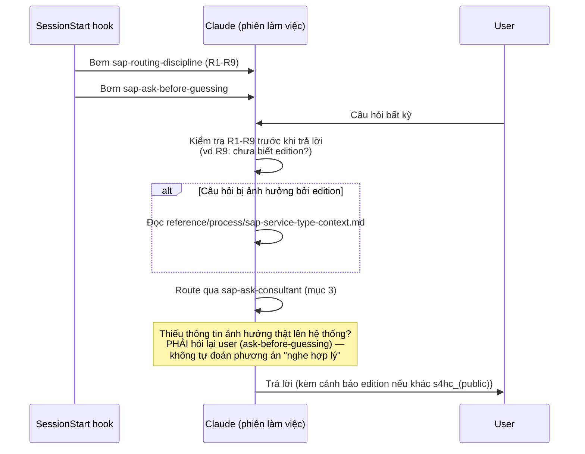

# Kiến trúc & Quy trình Skill — SAP ABAP Agent

> File này được `CLAUDE.md` đánh dấu "chưa có — có thể tạo nếu cần". Tạo ngày 2026-07-31
> ngay sau đợt tái cấu trúc skill (`docs/audits/2026-Q3-skill-consolidation-part2.md`,
> `docs/plans/completed/skill-consolidation-2026-07-31.md`) — mục đích: một nơi duy nhất vẽ
> lại toàn bộ quy trình sử dụng 38 skill hiện có, để không cần đọc lại 28 agent + 38 skill mỗi
> lần muốn nhớ "cái gì gọi cái gì".

## 1. Nguyên tắc tổng quan — 2 tầng

Plugin chỉ có **đúng 2 cách một skill được "dùng tới"**:

| Tầng | Vị trí | Cách kích hoạt | Ai đọc |
|---|---|---|---|
| **Tầng chính** | `skills/` (38 skill) | Tự động, Claude Code quét `when_to_use` theo từ khóa bất kỳ lúc nào | Người dùng gõ tự nhiên |
| **Tầng ẩn nhưng liên kết** | `reference/modules/`, `reference/process/`, `reference/mcp-guides/` | Chỉ khi một skill/agent khác chủ động `Read` đúng đường dẫn, nêu rõ trong nội dung của nó | Chỉ agent/skill gọi tới, không tự trigger |

Không có "skill con" nằm lồng trong skill khác — Claude Code chỉ quét `skills/<tên>/SKILL.md`
đúng 1 cấp. Nên "ẩn bớt mà vẫn dùng được" trong plugin này **luôn luôn** có nghĩa là: di
chuyển file sang `reference/`, rồi để đúng 1 skill/agent còn lại trỏ tới nó bằng tên trong văn
bản. Sơ đồ dưới đây vẽ lại toàn bộ mạng lưới "trỏ tới bằng tên" đó.

## 2. Quy trình chính — Pipeline codegen (FS → Finish)

Đây là quy trình một ticket đi từ file đặc tả đến code đã review/test xong. Mỗi mũi tên là
1 skill; ô màu hổ phách là điểm dừng bắt buộc (gate).

```mermaid
flowchart LR
    DOC["File .docx/.xlsx"] -->|"sap-doc-to-md"| MD["Markdown"]
    MD -->|"sap-analyze-function-spec<br/>(bước 1)"| INTAKE["INTAKE.md"]
    INTAKE -->|"sap-write-technical-spec<br/>(bước 2)"| SPEC["TECHNICAL_SPEC.md"]

    SPEC --> GATE1{"sap-deployment-target<br/>xác nhận package + rào chắn Z/Y"}
    GATE1 --> BOOT["sap-bootstrap-system-context<br/>(lần đầu trên hệ thống mới)"]
    BOOT --> SCAFFOLD["Scaffold — bước 3:<br/>sap-scaffold-rap / sap-scaffold-cds /<br/>sap-scaffold-cds-analytics /<br/>sap-cloud-dictionary / sap-virtual-element /<br/>sap-migrate-segw-to-rap"]

    SCAFFOLD -->|"bước 4"| REVIEW["sap-atc-review"]
    REVIEW -->|"bước 5"| TEST["sap-unit-test /<br/>sap-cds-unit-test"]
    TEST --> VERIFY{"sap-verification-before-completion<br/>đã có bằng chứng chạy thật chưa?"}
    VERIFY -->|"chưa"| SCAFFOLD
    VERIFY -->|"rồi"| FINISH["sap-finish-ticket<br/>(bước 6)"]

    classDef stage fill:#2B3A67,stroke:#1A2440,color:#F5F3EC
    classDef gate fill:#8C6526,stroke:#6B4C1D,color:#F5F3EC
    classDef doc fill:#44403A,stroke:#2A2825,color:#F5F3EC
    class GATE1,VERIFY gate
    class DOC,MD,INTAKE,SPEC,FINISH doc
    class BOOT,SCAFFOLD,REVIEW,TEST stage
```

Xuyên suốt cả 6 bước, các skill kiến thức kỹ thuật (`sap-clean-code`, `sap-extensibility`,
`sap-abap-sql`, `sap-authorization`, `sap-odata-service`, `sap-badi-enhancement`,
`sap-rap-events`, `sap-released-classes`) được tra cứu **khi cần**, không phải theo tuần tự —
xem mục 6 để biết skill nào áp dụng ở đâu.

## 3. Quy trình tư vấn nghiệp vụ — bên trong `sap-ask-consultant`

`sap-ask-consultant` không tự trả lời — nó chấm điểm từ khóa rồi dispatch song song tới đúng
agent. Đây là logic đầy đủ (đã đọc trực tiếp `skills/sap-ask-consultant/SKILL.md`, không tóm
tắt sai):

**Backend mặc định** cho cả 25 agent tư vấn là `sap-connect` (CRUD ABAP chuẩn qua
`mcp-sap-connect`); khi cần package health/dead-code/debug, agent tự hỏi
`reference/process/sap-multi-system-context.md` trước khi gọi tool khác server.

## 4. Kỷ luật xuyên suốt — bơm qua hook, không cần gọi tên

2 skill duy nhất được bơm cứng vào **mọi** phiên qua `hooks/hooks.json` (SessionStart), không
chờ khớp từ khóa:

`sap-verification-before-completion` áp dụng nguyên tắc song song ở **đầu ra** của mọi
pipeline (mục 2): không báo "xong" nếu chỉ dựa vào đọc code, phải có bằng chứng chạy thật.

## 5. Tầng "ẩn nhưng liên kết" — ai gọi cái gì

| Reference doc | Được gọi bởi |
|---|---|
| `reference/process/sap-multi-system-context.md` | `sap-ask-consultant` (bước 5.5), "Backend capability" trong 25 agent |
| `reference/process/sap-service-type-context.md` | `sap-routing-discipline` (R9), `sap-ask-consultant`, `sap-extensibility`, `sap-clean-code`, `sap-abap-sql` |
| `reference/process/sap-context-module-routing.md` | Tác giả plugin (khi tách thêm module core+deep) |
| `reference/process/sap-context-tool-result-trim.md` | `sap-routing-discipline` (Tier 2.2), `sap-cds-kb`, `sap-atc-review`, `sap-scaffold-rap/cds` |
| `reference/process/sap-scaffold-context-summary.md` | `sap-scaffold-rap/cds`, `sap-write-technical-spec` |
| `reference/mcp-guides/mcp-sap-adt.md`, `mcp-sap-gui.md` | `sap-docs-researcher`, `sap-bootstrap-system-context`, `sap-deployment-target` |
| `reference/mcp-guides/mcp-sap-notes.md`, `mcp-sap-concur.md`, `mcp-sap-fieldglass.md` | `sap-docs-researcher` |
| `reference/mcp-guides/mcp-sap-successfactors.md` | `sap-docs-researcher`, khai báo trong `agents/sap-successfactors-consultant-cloud.md` |
| `reference/mcp-guides/mcp-sap-cdata-setup.md` | 3 file CData ở trên (mẫu cài đặt dùng chung) |
| `reference/modules/sap-btp-connectivity/SKILL.md` | `sap-btp-admin-consultant-cloud` + 8 module `*-integration/SKILL.md` (HCM, GTS, CA, Fiori role, BW, PS, TR, WM-EWM) |
| `reference/modules/<module>-cloud/` (26 module) | Đúng 1 agent tư vấn tương ứng, theo `skills:` trong frontmatter |

## 6. Danh mục 38 skill theo nhóm

| Nhóm | Skill | Vai trò 1 dòng |
|---|---|---|
| **Hub trung tâm** | `sap-ask-consultant` | Entry point routing nghiệp vụ (mục 3) |
| **Kỷ luật hook-injected** | `sap-routing-discipline`, `sap-ask-before-guessing` | Bơm mọi phiên, không cần gọi tên (mục 4) |
| **Kỷ luật universal** | `sap-verification-before-completion`, `sap-systematic-debugging` | Áp dụng bất kỳ giai đoạn nào |
| **Pipeline — tiền xử lý** | `sap-doc-to-md` | Convert .docx/.xlsx trước INTAKE |
| **Pipeline — bước 1-2** | `sap-analyze-function-spec`, `sap-write-technical-spec` | FS → INTAKE → TECHNICAL_SPEC |
| **Pipeline — gate an toàn** | `sap-deployment-target`, `sap-bootstrap-system-context` | Xác nhận package/quy ước trước scaffold |
| **Pipeline — scaffold (bước 3)** | `sap-scaffold-rap`, `sap-scaffold-cds`, `sap-scaffold-cds-analytics`, `sap-cloud-dictionary`, `sap-virtual-element`, `sap-migrate-segw-to-rap` | Sinh code |
| **Pipeline — review/test (bước 4-5)** | `sap-atc-review`, `sap-unit-test`, `sap-cds-unit-test` | Lint + test |
| **Pipeline — kết thúc (bước 6)** | `sap-finish-ticket` | Checklist đóng ticket |
| **Review bổ sung** | `sap-security-review`, `sap-clean-code` | Gọi từ `abap-reviewer` |
| **Kiến thức kỹ thuật ABAP Cloud** | `sap-abap-sql`, `sap-authorization`, `sap-rap-events`, `sap-released-classes`, `sap-odata-service`, `sap-badi-enhancement`, `sap-extensibility` | Tra cứu trực tiếp bất kỳ lúc nào (xem `docs/audits/2026-Q3-skill-consolidation-part2.md` — đã cân nhắc gộp, quyết định giữ nguyên) |
| **Key user (khác đối tượng)** | `sap-key-user-toolkit` | Functional consultant, không cần ABAP |
| **Tra cứu/nghiên cứu** | `sap-cds-kb`, `sap-docs-research`, `sap-daily-learner` | Lookup xuyên suốt |
| **Hạ tầng/troubleshoot** | `sap-btp-setup`, `sap-mcp-status` | Setup + chẩn đoán MCP |
| **Action skill riêng lẻ** | `sap-package-backup`, `sap-handoff`, `sap-cloud-migration` | Gọi trực tiếp theo nhu cầu cụ thể |
| **Placeholder** | `sap-user-skills` | Rỗng, chỗ user tự thêm skill riêng — không tính vào 38 |

## 7. Nguồn

- `docs/audits/2026-Q3-skill-rationalization.md` (2026-07-14) — đợt rà soát đầu tiên, giảm 75
  file kiến thức xuống còn cấu trúc hiện tại.
- `docs/audits/2026-Q3-skill-consolidation-part2.md` (2026-07-31) — đợt hai: hợp nhất BTP,
  chuyển thêm 5 skill sang `reference/`, và kết luận không gộp nhóm kiến thức kỹ thuật.
- `docs/plans/completed/skill-consolidation-2026-07-31.md` — plan + validation chi tiết của
  đợt hai.
- `SKILL_TEMPLATE.md` — quy ước frontmatter, giới hạn 1.536 ký tự cho
  `description`+`when_to_use`.
